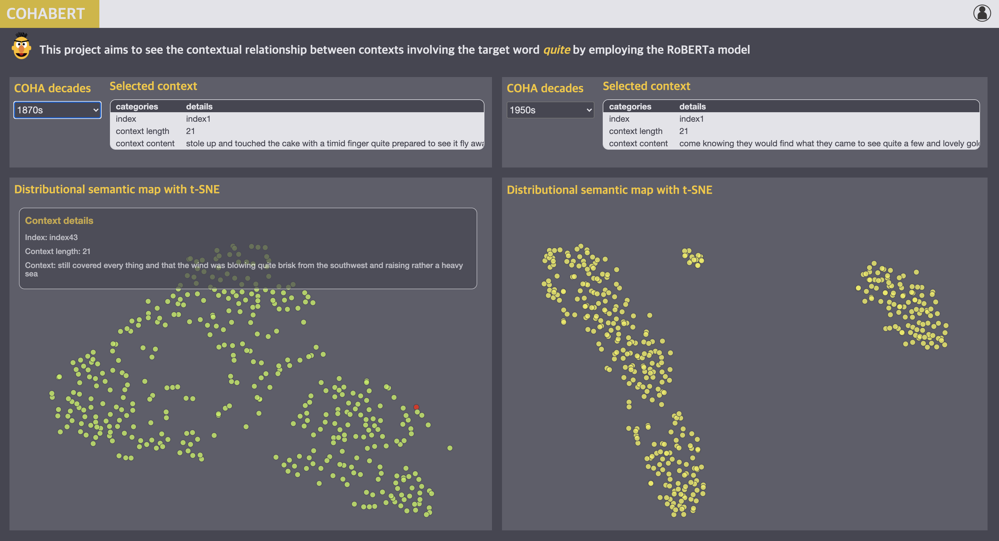

# COHABERT

<!--      -->
     

## Abstract
COHABERT was made to see the contextual relationship between contexts involving the target word quite by employing the RoBERTa model.

### Screenshots
-----------

  </img>

- [Try to use COHABERT](https://seongmin-mun.github.io/COHABERT/index.html)

### Skills
-------
Machine Learning & NLP & Statistics

- Computer Languages: Java, R, Python
- DataBase: MySQL, MongoDB
- Machine Learning: Sentence-Embedding (Bidirectional Encoder Representations from Transformers), t-SNE (t-Distributed Stochastic Neighbor Embedding)
- NLP-based methods: Dependency tagger, POS tagger, Pre-Processing (tokenization, lemmatization, N-gram, window size), etc.
- Tools: IntelliJ IDEA, PyCharm

Visualization Technique

- Visualization Method: Force directed graph, Distributional semantic map

Server (Back-end)

- Computer Languages: Java, Python, PHP
- DataBase: MySQL
- Libraries: Python (numpy, sklearn, pandas, nltk, gensim, scipy)
- Tools: IntelliJ IDEA, PyCharm

Client (Front-end)

- Computer Languages: Javascript (d3.js, jquery.js), HTML/CSS
- DataBase: json
- Tools: Atom, WebStorm

